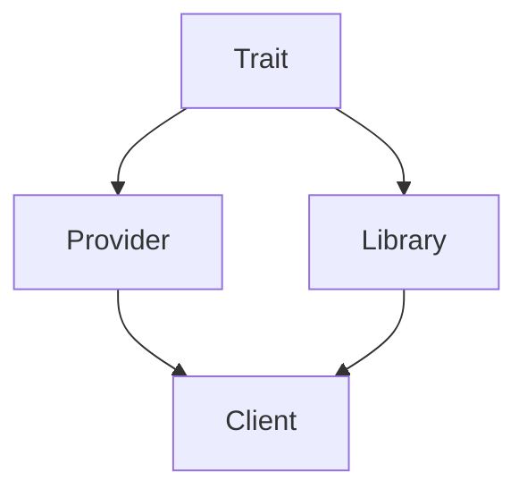
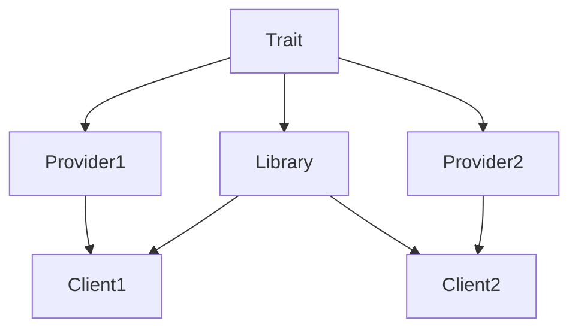
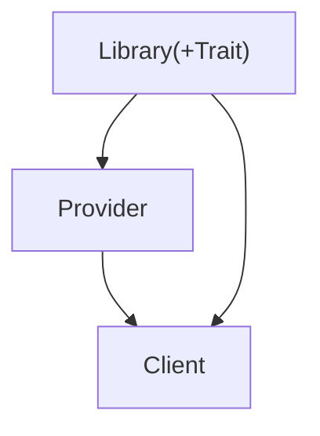
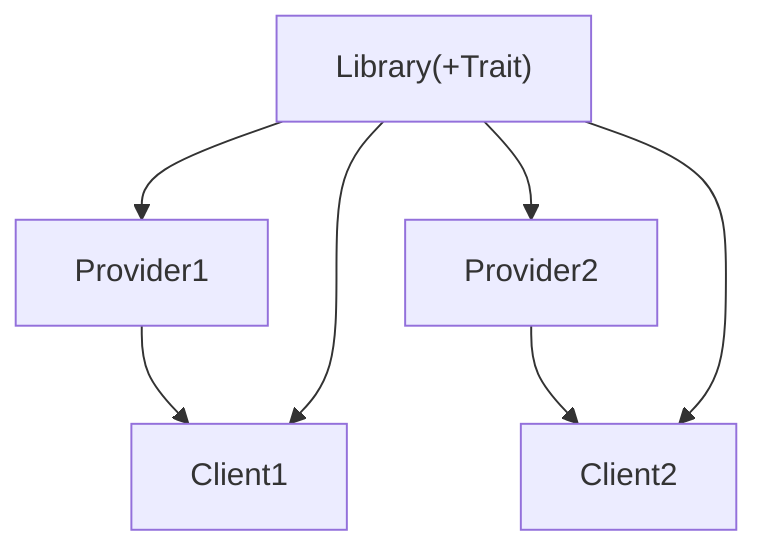
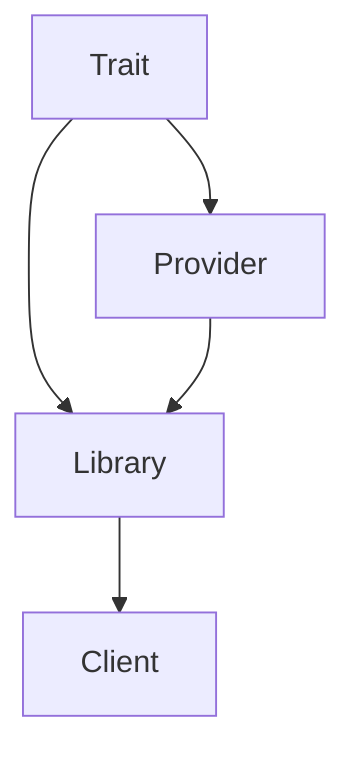
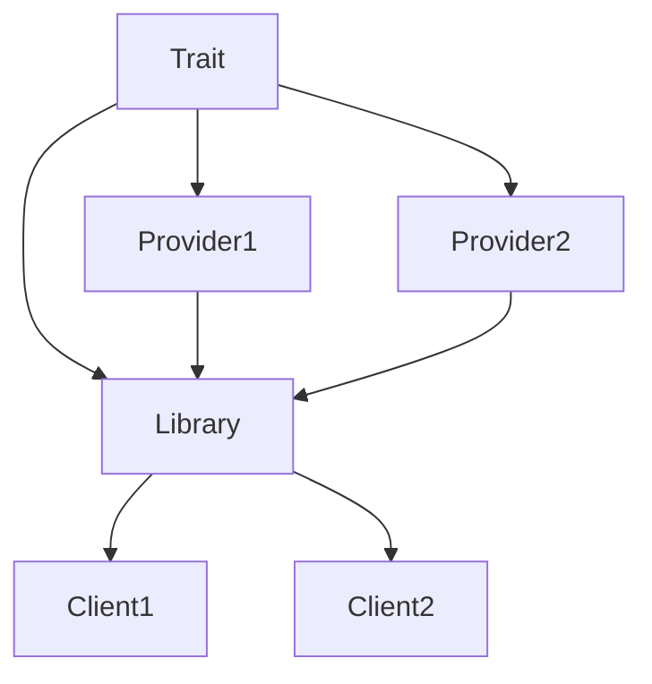

# Packaging

This guide shows how to architect the dependencies between different libraries involved in a typical provider setup.

- **Trait**: A library where you define your Traits and their signatures.
- **Library**: A library that is parameterized by your Traits.
- **Provider**: A library that implements your Traits.
- **Client**: An end user.

## Do

Here is the dependency graph you want to achieve (`dep -> a` means: library `a` depends on `dep`):

The provider and library must agree on the interface the providers will need to implement. These signatures will be defined in some common dependency.

This scales well with the appearance of alternative providers and multiple clients, allowing them to limit their dependencies as needed:

## Or do

Alternatively, you may group the Traits definition with the library and have the provider implementation depend on the entire library.

This scales well too:

## But don't do

What you usually want to avoid is for the library to inherit the dependencies of your providers.

The point of a parameterized library is to limit your dependencies. You will run into trouble if all clients depend on all providers!

